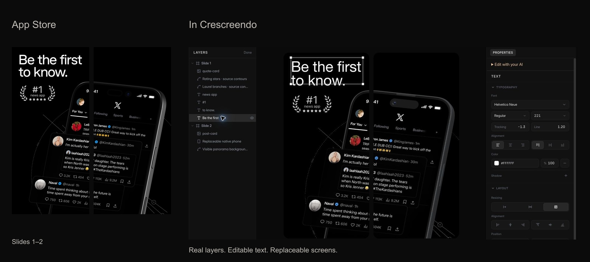
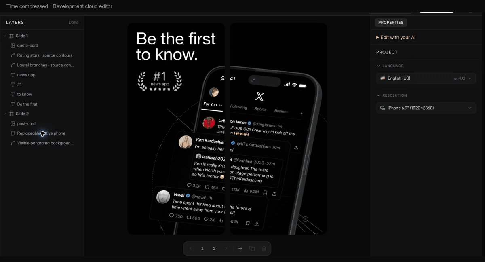
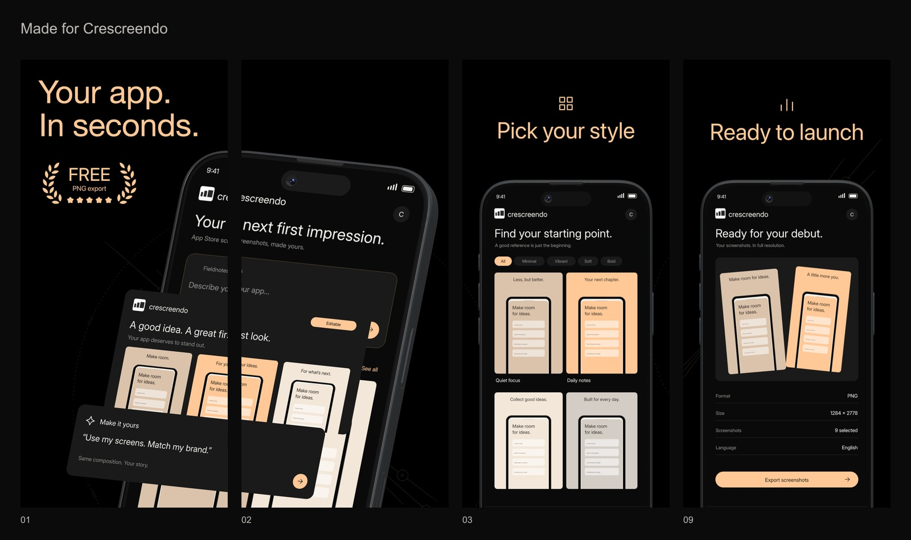
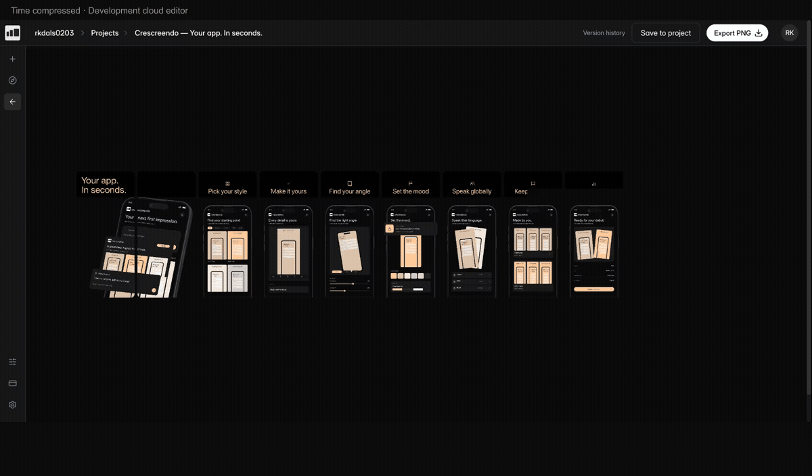

<h1 align="center">App Store Screenshot Template</h1>
<p align="center"><strong>Turn App Store screenshots into editable templates.</strong></p>
<p align="center">Give your AI agent an App Store link.<br>Reconstruct the screenshot set, open it in Crescreendo, and adapt it for your app.</p>
<p align="center"><sub>Open-source skill and tools · Cloud editor · Free reconstruction and export</sub></p>
<p align="center"><a href="#quick-start">Get started</a> · <a href="docs/x-case-study.md">See the example</a> · <a href="docs/setup.md">Connect your AI</a> · <a href="#faq">FAQ</a></p>


<p align="center"><sub>One reference. Editable text, screens and objects. <a href="docs/x-case-study.md">See the full set and remaining differences →</a></sub></p>

| Bring a reference | Make it editable | Make it yours |
| --- | --- | --- |
| An App Store link and the complete screenshot set. | Real text, replaceable screens, reusable layouts. | Your screens, headlines and colors, with PNG export. |

> **Cloud preview.** Install the plugin or skill below and use the hosted editor. No local editor download. [Verification and known limits](docs/release-checklist.md).

> **Available now:** reconstruct, edit with your connected AI or manually, save one app, and export watermark-free PNGs. **Pro is coming soon:** new subscriptions and the planned Pro AI-editing restriction are not enabled. Your AI provider bills its own usage; the connected service reports current access.

## Quick start

### 1. Install the plugin for your AI

The plugin bundles the reconstruction skill and Crescreendo's remote MCP connection.
Choose your host, install, then sign in when prompted. No editor or Chromium download.

<details open>
<summary><strong>Codex</strong></summary>

```bash
codex plugin marketplace add rkdals0203/appstore-screenshot-template
codex plugin add appstore-screenshot-template@crescreendo
```

In Codex, open the plugin and use **Connect** to sign in and choose project access.
Start a new conversation if the installed skill or tools do not appear.

</details>

<details>
<summary><strong>Claude Code</strong></summary>

```bash
claude plugin marketplace add rkdals0203/appstore-screenshot-template
claude plugin install appstore-screenshot-template@crescreendo --scope user
```

Open `/mcp`, select the plugin's Crescreendo server, and complete authentication.
Restart the session if the plugin is not loaded yet.

</details>

<details>
<summary><strong>Prefer installing only the skill?</strong></summary>

```bash
npx skills add rkdals0203/appstore-screenshot-template
```

Requires Node.js 22.20+ for the current `skills` installer.

Give your agent the App Store request below. On first use it runs the bundled setup
helper for Codex or Claude Code, then guides you through sign-in. Installation itself
only copies the skill; it does not change MCP settings or grant account access.
If the host needs a fresh session to load tools, resume the same request there.

</details>

Use one installation path. [Setup and troubleshooting →](docs/setup.md)

### 2. Give your agent an App Store link

```text
Use appstore-screenshot-template to reconstruct the complete screenshot
set at this App Store URL as an editable Crescreendo draft:

[App Store URL]

Compare it with the original and open the cloud editor.
```

Your AI collects the references, creates editable objects, uploads the necessary assets, and opens the cloud editor for the draft. With that tab open, it captures and inspects the result. You can edit and export before saving it to an app.

### 3. Make it yours

Review the reconstruction with your AI, then ask it to adapt the template or keep
refining the design. The agent checks the service's current access before editing:

```text
Adapt this draft for my app using the screenshots I attached.
Update the headlines and colors while keeping the design editable.
```

When the Pro editing policy launches, the editor will ask you to **Confirm reconstruction**
yourself. Original review corrections will remain free; AI adaptation and later AI editing
will require Pro. Manual screen replacement, text editing and PNG export will remain free.

Use **Save to project** to choose an existing app, a GitHub repository, or a new app. Saving is your choice; your AI does not submit contribution consent. Free supports one app with multiple project documents. A second app requires Pro. PNG export has no watermark.

## Replace the screen. Keep the composition.



Your content changes. The device, tilt, crop and layout stay editable. Time compressed; recorded in Development. [Still image](media/replace-screen-poster.jpg).

## Same template. Your app.



**Your app. In seconds.** The same layout, adapted with Crescreendo colors and imagined app screens. Frames 1, 2, 3 and 9 from the nine-frame example; the opening phone spans two separate exports. [All nine frames](docs/x-case-study.md).

## Save it. Pick up where you left off.



Edit and export first. Save to your app when you want to keep working. Time compressed; recorded in Development. [Still image](media/save-and-reopen-poster.jpg).

## What you can edit

| Element | Editable form |
| --- | --- |
| Headlines and captions | Text, typography, position and color |
| Backgrounds and shapes | Supported editable objects |
| Phone screens | Replaceable image bindings inside native mockups |
| Angled cards | Image content separate from tilt, crop and layout |
| Photos and app UI | Movable, replaceable images; their internal pixels are not all separate text objects |

Reconstruction preserves the reference first. Manual adaptation is free. Adapting it with your AI is a separate Pro editing request once the policy is active.

## Requirements and costs

Use an AI agent that can inspect images, access MCP, run tools, and read local files. Image reconstruction additionally needs an image tool connected to that agent. Codex and Claude Code are the supported setup targets. The standalone installer requires Node.js 22.20+; the bundled helper and local source tools support Node.js 20.19+. See [tested versions and release limits](docs/setup.md).

Your AI agent and image tools use your existing provider's limits and billing. Crescreendo MCP does not call paid generation models on your behalf. Editing and watermark-free PNG export are available on Free. Planned Pro pricing is $12/month or $99/year for AI adaptation, continued AI editing, language variants, more apps and full version history. New purchases and the AI-editing restriction are currently disabled; this is not a promise of unlimited free AI editing.

Working source files stay on your computer. Required document assets are uploaded to Crescreendo, and your AI provider may process your inputs. Cloud editing and rendering require a connection.

## FAQ

**Does every link reconstruct perfectly in one attempt?** No. The agent compares actual renders and reports remaining differences. Schema validity is not a design-quality verdict.

**What about hidden image regions?** Image tools can infer missing content where necessary, but that is not recovery of original pixels. The skill records limitations and does not silently pass a flattened image off as an editable template.

**Is the editor open source?** This repository contains the MIT-licensed skill, document core and source/transfer tools. The hosted editor, renderer, authentication and billing are separate private software. No editor build is distributed here.

**Plugin or skill?** Both use the same reconstruction instructions. The plugin also bundles the remote MCP configuration. The standalone skill prepares that connection on first use. Both require your Crescreendo sign-in and access approval.

**Must I save before exporting?** No. A draft can be edited and exported. **Save to project** keeps it under your app. Local working JSON is not a saved Cloud project.

**Does saving publish my work?** No. An unchanged reconstruction with sufficient source evidence may offer a separate, unchecked contribution option. Your private saved project is independent of any consented contribution copy.

**Can I bring an older project?** The public document contract remains editable and portable. Crescreendo's import path accepts supported project archives. The new skill does not reinstall retired editor releases.

## Contributing

See [Contributing](CONTRIBUTING.md), the [technical reference](docs/reference.md), and [MIT license](LICENSE). Examples need their own asset provenance; the code license does not grant rights to third-party App Store artwork.

Built for [Crescreendo](https://crescreendo.com).
