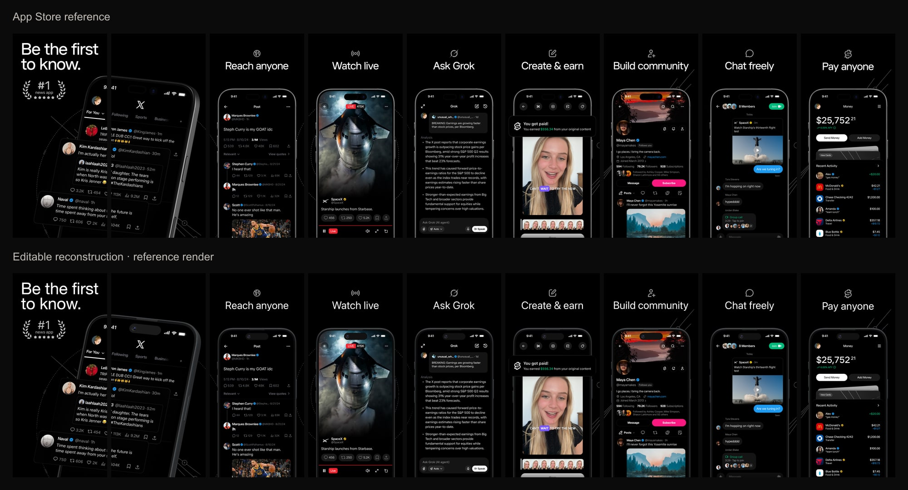
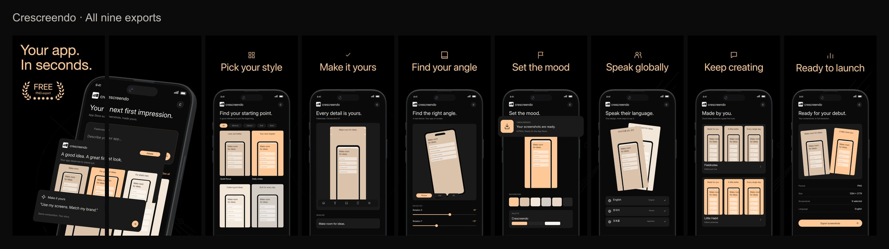

# One reference, two uses

The source is the [X App Store listing](https://apps.apple.com/us/app/x/id333903271). First reconstruct its screenshot set; then make a separate adaptation for Crescreendo.

## The editable reconstruction

The nine-frame document preserves the reference order. Its structure contains eight native device mockups, three independent image objects, editable marketing headlines, and vector decoration. One phone crosses the first two frames as a shared panorama object. App UI and photos remain image content; their internal text is not individually editable.

The README comparison uses the original headline and colors in the editor so that reconstruction and adaptation can be judged separately. Actual layer selection and typography controls show what is editable.

The editor close-up is an excerpt containing frames 1–2, opened in the Development cloud editor. The complete nine-frame source comparison below uses the preserved reconstruction render from September 26, 2026; it is not a new server-render result.

## The Crescreendo adaptation

Black backgrounds and Crescreendo peach (`#FFC896`) carry through the headlines, laurel, stars and feature icons. App UI controls use neutral colors. The opening reads **Your app. In seconds.**, with **FREE / PNG export** inside the decorative laurel.

The mobile UI is original concept artwork made for this demonstration. It is not a screenshot of a released Crescreendo mobile app. The laurel and stars are decoration, not a claimed store rating or award. “In seconds” is example marketing copy, not a measured reconstruction-time claim.

Each exported frame is presented with the same gap. The opening pair remains two separate PNG files even though a phone crosses their shared design boundary.

These PNGs came from the real browser editor's **Export PNG** action. The separate nine-frame server-render attempt reached its time limit and was canceled; this media set does not claim that server-render check passed.

## What the clips prove

The replacement clip shows a screen-file replacement and a text edit in the two-frame excerpt. The save clip shows the full adaptation becoming a saved project, followed by reopening the same document. Waiting and the native file picker are cut. These are editing and persistence demonstrations, not an uncut one-shot reconstruction.

## Remaining fidelity limits

The original font has not been conclusively identified. Device hardware and pose can differ from the original artwork. The mockup and image tilt use orthographic projection; that does not reproduce every strong perspective distortion. Hidden source pixels have not been recovered. A rendered or schema-valid document is not a claim of pixel-perfect reconstruction.

X artwork is shown for comparison. It is not included as a downloadable template or covered by this repository's code license. Fonts, device models and complete working projects are not distributed with these media files.

See [capture requirements](demo.md) and [media provenance](../media/README.md).
